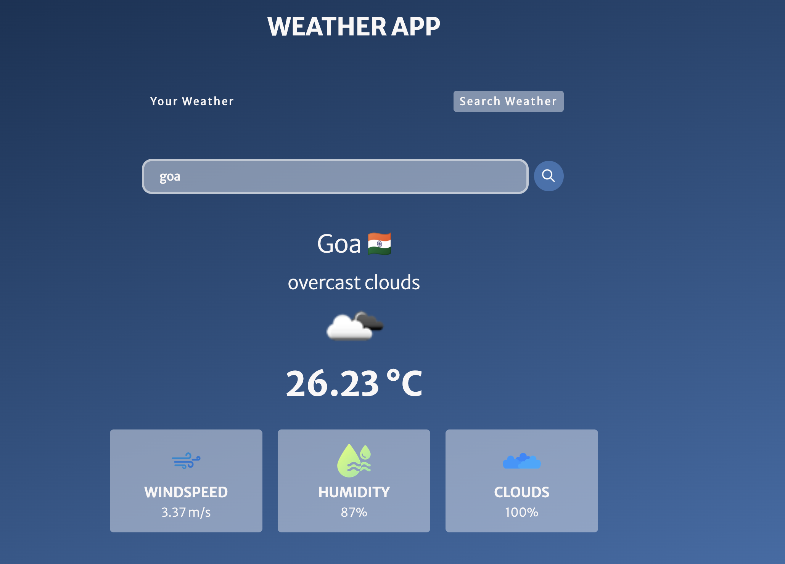
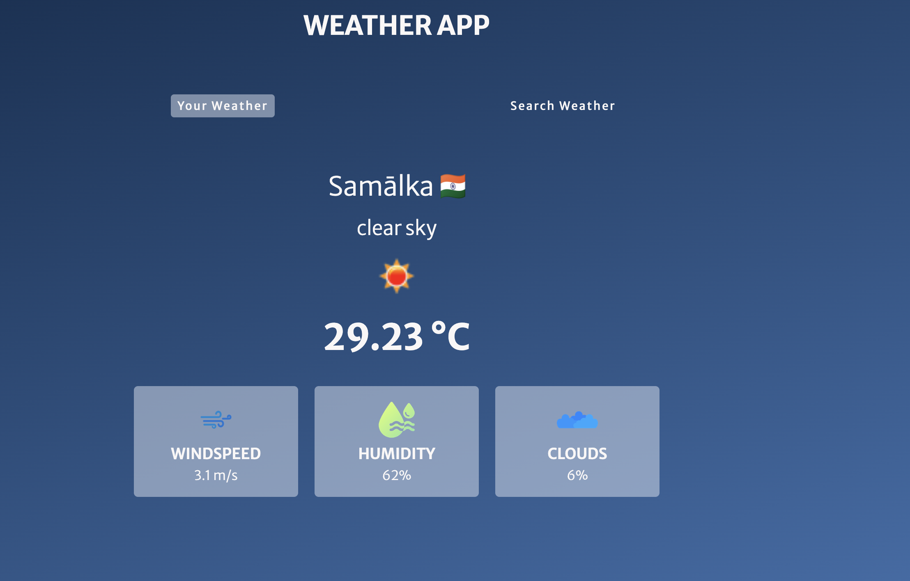
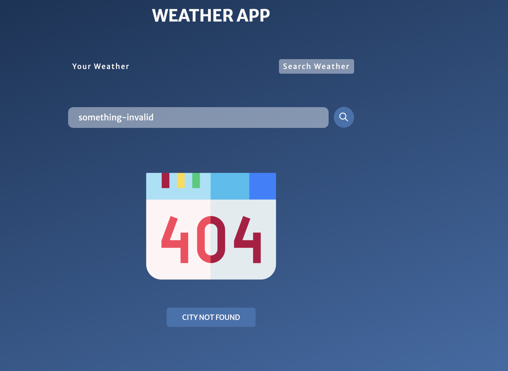

# 🌦️ Weather App

A modern, responsive **Weather App** built using **HTML, CSS, and JavaScript**, allowing users to get live weather updates based on **their current location** or by **searching any city**. The app uses the **OpenWeatherMap API** and includes a clean UI, weather icons, flag integration, and smooth error handling.

---

## 📸 Screenshots

### 🔍 1. Search Weather by City

### 📍 2. Weather Using Your Location

### ❌ 3. Invalid City Search (Error Page)

---

## ✨ Features

- 🌍 Fetches **real-time weather** using:
  - 📍 Current Location (via Geolocation API)
  - 🔎 Manual City Search
- 📊 Displays:
  - City name and country flag
  - Weather description + icon
  - Temperature (in °C)
  - Wind speed
  - Humidity
  - Cloudiness
- 🖼️ Shows a **custom error image** if the city is invalid
- 🔁 Retry button for API errors
- ⚙️ Responsive design, clean UI, smooth transitions

---

## 🔧 Tech Stack

| Area     | Technology                     |
|----------|---------------------------------|
| Markup   | HTML5                          |
| Styling  | CSS3 (Responsive)              |
| Logic    | JavaScript (ES6+)              |
| Weather  | [OpenWeatherMap API](https://openweathermap.org/) |
| Flags    | [FlagCDN](https://flagcdn.com/) |
| Fonts    | Google Fonts - Merriweather Sans |

---

